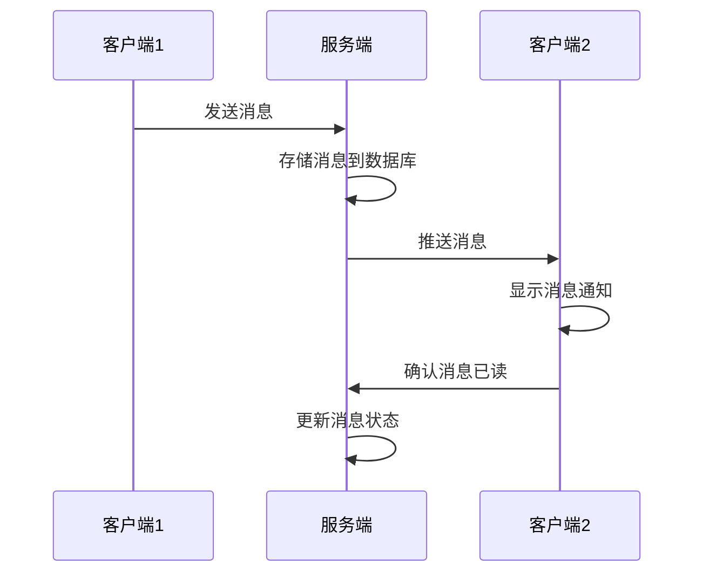

# 即时通讯模块开发设计文档

## 1. 概述

本文档旨在设计和规划一个网页即时通讯模块，包含好友管理、聊天列表、单聊/群聊功能，以及支持多种消息类型（文本、表情包、emoji、图片、文件、语音、视频）的发送功能。

## 2. 功能列表

### 2.1 核心功能
1. 好友管理
   - 好友列表展示
   - 好友添加/删除
   - 好友信息查看
2. 聊天管理
   - 聊天列表展示
   - 单聊支持
   - 群聊支持
3. 消息管理
   - 文本消息发送
   - 表情包消息发送
   - 文本emoji混合消息发送
   - 图片消息发送
   - 文件消息发送
   - 语音消息发送
   - 视频消息发送
4. 实时通讯
   - 消息实时推送
   - 在线状态管理
   - 消息已读/未读状态

## 3. 数据库表结构设计

### 3.1 用户好友关系表(im_friend)
```sql
CREATE TABLE `im_friend` (
  `id` bigint(20) NOT NULL COMMENT '主键ID',
  `user_id` bigint(20) NOT NULL COMMENT '用户ID',
  `friend_id` bigint(20) NOT NULL COMMENT '好友ID',
  `friend_group_id` bigint(20) DEFAULT NULL COMMENT '好友分组ID',
  `remark` varchar(50) DEFAULT NULL COMMENT '好友备注',
  `status` tinyint(1) DEFAULT '1' COMMENT '状态: 1正常 2删除',
  `created_time` datetime NOT NULL DEFAULT CURRENT_TIMESTAMP COMMENT '创建时间',
  `updated_time` datetime NOT NULL DEFAULT CURRENT_TIMESTAMP ON UPDATE CURRENT_TIMESTAMP COMMENT '更新时间',
  PRIMARY KEY (`id`),
  UNIQUE KEY `uk_user_friend` (`user_id`,`friend_id`),
  KEY `idx_user_id` (`user_id`),
  KEY `idx_friend_id` (`friend_id`)
) ENGINE=InnoDB DEFAULT CHARSET=utf8mb4 COMMENT='用户好友关系表';
```

### 3.2 好友分组表(im_friend_group)
```sql
CREATE TABLE `im_friend_group` (
  `id` bigint(20) NOT NULL COMMENT '主键ID',
  `user_id` bigint(20) NOT NULL COMMENT '用户ID',
  `group_name` varchar(50) NOT NULL COMMENT '分组名称',
  `sort` int(11) DEFAULT '0' COMMENT '排序',
  `created_time` datetime NOT NULL DEFAULT CURRENT_TIMESTAMP COMMENT '创建时间',
  `updated_time` datetime NOT NULL DEFAULT CURRENT_TIMESTAMP ON UPDATE CURRENT_TIMESTAMP COMMENT '更新时间',
  PRIMARY KEY (`id`),
  KEY `idx_user_id` (`user_id`)
) ENGINE=InnoDB DEFAULT CHARSET=utf8mb4 COMMENT='好友分组表';
```

### 3.3 聊天会话表(im_chat_session)
```sql
CREATE TABLE `im_chat_session` (
  `id` bigint(20) NOT NULL COMMENT '主键ID',
  `session_id` varchar(64) NOT NULL COMMENT '会话ID',
  `session_type` tinyint(1) NOT NULL DEFAULT '1' COMMENT '会话类型: 1单聊 2群聊',
  `session_name` varchar(100) DEFAULT NULL COMMENT '会话名称',
  `session_avatar` varchar(255) DEFAULT NULL COMMENT '会话头像',
  `user_ids` text NOT NULL COMMENT '参与用户ID列表(逗号分隔)',
  `last_message_id` bigint(20) DEFAULT NULL COMMENT '最后消息ID',
  `last_message_time` datetime DEFAULT NULL COMMENT '最后消息时间',
  `last_message_content` varchar(500) DEFAULT NULL COMMENT '最后消息内容',
  `unread_count` int(11) DEFAULT '0' COMMENT '未读消息数',
  `created_time` datetime NOT NULL DEFAULT CURRENT_TIMESTAMP COMMENT '创建时间',
  `updated_time` datetime NOT NULL DEFAULT CURRENT_TIMESTAMP ON UPDATE CURRENT_TIMESTAMP COMMENT '更新时间',
  PRIMARY KEY (`id`),
  UNIQUE KEY `uk_session_id` (`session_id`),
  KEY `idx_last_message_time` (`last_message_time`)
) ENGINE=InnoDB DEFAULT CHARSET=utf8mb4 COMMENT='聊天会话表';
```

### 3.4 群聊信息表(im_group)
```sql
CREATE TABLE `im_group` (
  `id` bigint(20) NOT NULL COMMENT '主键ID',
  `group_id` varchar(64) NOT NULL COMMENT '群ID',
  `group_name` varchar(100) NOT NULL COMMENT '群名称',
  `group_avatar` varchar(255) DEFAULT NULL COMMENT '群头像',
  `group_notice` varchar(500) DEFAULT NULL COMMENT '群公告',
  `creator_id` bigint(20) NOT NULL COMMENT '创建者ID',
  `max_members` int(11) DEFAULT '200' COMMENT '最大成员数',
  `current_members` int(11) DEFAULT '1' COMMENT '当前成员数',
  `status` tinyint(1) DEFAULT '1' COMMENT '状态: 1正常 2解散',
  `created_time` datetime NOT NULL DEFAULT CURRENT_TIMESTAMP COMMENT '创建时间',
  `updated_time` datetime NOT NULL DEFAULT CURRENT_TIMESTAMP ON UPDATE CURRENT_TIMESTAMP COMMENT '更新时间',
  PRIMARY KEY (`id`),
  UNIQUE KEY `uk_group_id` (`group_id`),
  KEY `idx_creator_id` (`creator_id`)
) ENGINE=InnoDB DEFAULT CHARSET=utf8mb4 COMMENT='群聊信息表';
```

### 3.5 群成员表(im_group_member)
```sql
CREATE TABLE `im_group_member` (
  `id` bigint(20) NOT NULL COMMENT '主键ID',
  `group_id` varchar(64) NOT NULL COMMENT '群ID',
  `user_id` bigint(20) NOT NULL COMMENT '用户ID',
  `user_nickname` varchar(100) DEFAULT NULL COMMENT '群内昵称',
  `role` tinyint(1) DEFAULT '1' COMMENT '角色: 1成员 2管理员 3群主',
  `status` tinyint(1) DEFAULT '1' COMMENT '状态: 1正常 2退出',
  `join_time` datetime NOT NULL DEFAULT CURRENT_TIMESTAMP COMMENT '加入时间',
  `created_time` datetime NOT NULL DEFAULT CURRENT_TIMESTAMP COMMENT '创建时间',
  `updated_time` datetime NOT NULL DEFAULT CURRENT_TIMESTAMP ON UPDATE CURRENT_TIMESTAMP COMMENT '更新时间',
  PRIMARY KEY (`id`),
  UNIQUE KEY `uk_group_user` (`group_id`,`user_id`),
  KEY `idx_group_id` (`group_id`),
  KEY `idx_user_id` (`user_id`)
) ENGINE=InnoDB DEFAULT CHARSET=utf8mb4 COMMENT='群成员表';
```

### 3.6 消息表(im_message)
```sql
CREATE TABLE `im_message` (
  `id` bigint(20) NOT NULL COMMENT '主键ID',
  `message_id` varchar(64) NOT NULL COMMENT '消息ID',
  `session_id` varchar(64) NOT NULL COMMENT '会话ID',
  `sender_id` bigint(20) NOT NULL COMMENT '发送者ID',
  `message_type` tinyint(1) NOT NULL DEFAULT '1' COMMENT '消息类型: 1文本 2图片 3文件 4语音 5视频 6表情 7混合',
  `content` text COMMENT '消息内容',
  `file_id` varchar(64) DEFAULT NULL COMMENT '文件ID',
  `file_name` varchar(255) DEFAULT NULL COMMENT '文件名称',
  `file_size` bigint(20) DEFAULT NULL COMMENT '文件大小',
  `file_url` varchar(500) DEFAULT NULL COMMENT '文件URL',
  `status` tinyint(1) DEFAULT '1' COMMENT '状态: 1正常 2撤回',
  `send_time` datetime NOT NULL DEFAULT CURRENT_TIMESTAMP COMMENT '发送时间',
  `created_time` datetime NOT NULL DEFAULT CURRENT_TIMESTAMP COMMENT '创建时间',
  `updated_time` datetime NOT NULL DEFAULT CURRENT_TIMESTAMP ON UPDATE CURRENT_TIMESTAMP COMMENT '更新时间',
  PRIMARY KEY (`id`),
  UNIQUE KEY `uk_message_id` (`message_id`),
  KEY `idx_session_id` (`session_id`),
  KEY `idx_sender_id` (`sender_id`),
  KEY `idx_send_time` (`send_time`)
) ENGINE=InnoDB DEFAULT CHARSET=utf8mb4 COMMENT='消息表';
```

### 3.7 用户消息状态表(im_user_message)
```sql
CREATE TABLE `im_user_message` (
  `id` bigint(20) NOT NULL COMMENT '主键ID',
  `message_id` varchar(64) NOT NULL COMMENT '消息ID',
  `user_id` bigint(20) NOT NULL COMMENT '用户ID',
  `session_id` varchar(64) NOT NULL COMMENT '会话ID',
  `status` tinyint(1) DEFAULT '1' COMMENT '状态: 1未读 2已读 3已撤回',
  `read_time` datetime DEFAULT NULL COMMENT '阅读时间',
  `created_time` datetime NOT NULL DEFAULT CURRENT_TIMESTAMP COMMENT '创建时间',
  `updated_time` datetime NOT NULL DEFAULT CURRENT_TIMESTAMP ON UPDATE CURRENT_TIMESTAMP COMMENT '更新时间',
  PRIMARY KEY (`id`),
  UNIQUE KEY `uk_user_message` (`message_id`,`user_id`),
  KEY `idx_user_id` (`user_id`),
  KEY `idx_session_id` (`session_id`),
  KEY `idx_status` (`status`)
) ENGINE=InnoDB DEFAULT CHARSET=utf8mb4 COMMENT='用户消息状态表';
```

## 4. 后端代码设计

### 4.1 模块结构
```
fa-im/
├── src/
│   ├── main/
│   │   ├── java/com/faber/api/im/
│   │   │   ├── friend/              # 好友管理模块
│   │   │   │   ├── biz/
│   │   │   │   ├── entity/
│   │   │   │   ├── mapper/
│   │   │   │   └── rest/
│   │   │   ├── session/             # 会话管理模块
│   │   │   │   ├── biz/
│   │   │   │   ├── entity/
│   │   │   │   ├── mapper/
│   │   │   │   └── rest/
│   │   │   ├── message/             # 消息管理模块
│   │   │   │   ├── biz/
│   │   │   │   ├── entity/
│   │   │   │   ├── mapper/
│   │   │   │   └── rest/
│   │   │   ├── group/               # 群组管理模块
│   │   │   │   ├── biz/
│   │   │   │   ├── entity/
│   │   │   │   ├── mapper/
│   │   │   │   └── rest/
│   │   │   └── ImApplication.java   # 启动类
│   │   └── resources/
│   │       ├── mapper/              # MyBatis映射文件
│   │       └── sql/                 # SQL脚本
│   └── test/
└── pom.xml
```

### 4.2 核心实体类设计

#### 4.2.1 好友关系实体类(ImFriend)
```java
package com.faber.api.im.friend.entity;

import com.faber.core.bean.BaseDelEntity;
import com.baomidou.mybatisplus.annotation.TableName;
import com.baomidou.mybatisplus.annotation.TableField;
import lombok.Data;
import lombok.EqualsAndHashCode;

@Data
@EqualsAndHashCode(callSuper = false)
@TableName("im_friend")
public class ImFriend extends BaseDelEntity {
    /**
     * 用户ID
     */
    @TableField("user_id")
    private Long userId;

    /**
     * 好友ID
     */
    @TableField("friend_id")
    private Long friendId;

    /**
     * 好友分组ID
     */
    @TableField("friend_group_id")
    private Long friendGroupId;

    /**
     * 好友备注
     */
    @TableField("remark")
    private String remark;
}
```

#### 4.2.2 会话实体类(ImChatSession)
```java
package com.faber.api.im.session.entity;

import com.faber.core.bean.BaseDelEntity;
import com.baomidou.mybatisplus.annotation.TableName;
import com.baomidou.mybatisplus.annotation.TableField;
import lombok.Data;
import lombok.EqualsAndHashCode;

@Data
@EqualsAndHashCode(callSuper = false)
@TableName("im_chat_session")
public class ImChatSession extends BaseDelEntity {
    /**
     * 会话ID
     */
    @TableField("session_id")
    private String sessionId;

    /**
     * 会话类型: 1单聊 2群聊
     */
    @TableField("session_type")
    private Integer sessionType;

    /**
     * 会话名称
     */
    @TableField("session_name")
    private String sessionName;

    /**
     * 会话头像
     */
    @TableField("session_avatar")
    private String sessionAvatar;

    /**
     * 参与用户ID列表(逗号分隔)
     */
    @TableField("user_ids")
    private String userIds;

    /**
     * 最后消息ID
     */
    @TableField("last_message_id")
    private Long lastMessageId;

    /**
     * 最后消息时间
     */
    @TableField("last_message_time")
    private java.util.Date lastMessageTime;

    /**
     * 最后消息内容
     */
    @TableField("last_message_content")
    private String lastMessageContent;

    /**
     * 未读消息数
     */
    @TableField("unread_count")
    private Integer unreadCount;
}
```

#### 4.2.3 消息实体类(ImMessage)
```java
package com.faber.api.im.message.entity;

import com.faber.core.bean.BaseDelEntity;
import com.baomidou.mybatisplus.annotation.TableName;
import com.baomidou.mybatisplus.annotation.TableField;
import lombok.Data;
import lombok.EqualsAndHashCode;

@Data
@EqualsAndHashCode(callSuper = false)
@TableName("im_message")
public class ImMessage extends BaseDelEntity {
    /**
     * 消息ID
     */
    @TableField("message_id")
    private String messageId;

    /**
     * 会话ID
     */
    @TableField("session_id")
    private String sessionId;

    /**
     * 发送者ID
     */
    @TableField("sender_id")
    private Long senderId;

    /**
     * 消息类型: 1文本 2图片 3文件 4语音 5视频 6表情 7混合
     */
    @TableField("message_type")
    private Integer messageType;

    /**
     * 消息内容
     */
    @TableField("content")
    private String content;

    /**
     * 文件ID
     */
    @TableField("file_id")
    private String fileId;

    /**
     * 文件名称
     */
    @TableField("file_name")
    private String fileName;

    /**
     * 文件大小
     */
    @TableField("file_size")
    private Long fileSize;

    /**
     * 文件URL
     */
    @TableField("file_url")
    private String fileUrl;
}
```

## 5. 前端代码设计

### 5.1 模块结构
```
frontend/apps/admin/features/fa-im-pages/
├── components/                # 公共组件
│   ├── chat/                  # 聊天组件
│   ├── friend/                # 好友组件
│   └── session/               # 会话组件
├── pages/                     # 页面组件
│   ├── admin/                 # 管理端页面
│   │   └── im/                # 即时通讯页面
│   │       ├── friend/        # 好友管理页面
│   │       ├── session/       # 会话管理页面
│   │       └── chat/          # 聊天页面
│   └── h5/                    # 移动端页面
├── services/                  # API服务
│   ├── friend/                # 好友相关API
│   ├── session/               # 会话相关API
│   ├── message/               # 消息相关API
│   └── group/                 # 群组相关API
├── types/                     # TypeScript类型定义
│   ├── friend/                # 好友相关类型
│   ├── session/               # 会话相关类型
│   ├── message/               # 消息相关类型
│   └── group/                 # 群组相关类型
└── index.ts                   # 模块入口文件
```

### 5.2 核心类型定义

#### 5.2.1 好友相关类型定义
```typescript
// types/friend/ImFriend.ts
export interface ImFriend {
  id: number;              // 主键ID
  userId: number;          // 用户ID
  friendId: number;        // 好友ID
  friendGroupId?: number;  // 好友分组ID
  remark?: string;         // 好友备注
  deleted?: boolean;       // 删除状态
  crtTime?: string;        // 创建时间
  updTime?: string;        // 更新时间
}

// types/friend/ImFriendGroup.ts
export interface ImFriendGroup {
  id: number;              // 主键ID
  userId: number;          // 用户ID
  groupName: string;       // 分组名称
  sort?: number;           // 排序
  crtTime?: string;        // 创建时间
  updTime?: string;        // 更新时间
}
```

#### 5.2.2 会话相关类型定义
```typescript
// types/session/ImChatSession.ts
export interface ImChatSession {
  id: number;                    // 主键ID
  sessionId: string;             // 会话ID
  sessionType: number;           // 会话类型: 1单聊 2群聊
  sessionName?: string;          // 会话名称
  sessionAvatar?: string;        // 会话头像
  userIds: string;               // 参与用户ID列表(逗号分隔)
  lastMessageId?: number;        // 最后消息ID
  lastMessageTime?: string;      // 最后消息时间
  lastMessageContent?: string;   // 最后消息内容
  unreadCount: number;           // 未读消息数
  deleted?: boolean;             // 删除状态
  crtTime?: string;              // 创建时间
  updTime?: string;              // 更新时间
}
```

#### 5.2.3 消息相关类型定义
```typescript
// types/message/ImMessage.ts
export interface ImMessage {
  id: number;              // 主键ID
  messageId: string;       // 消息ID
  sessionId: string;       // 会话ID
  senderId: number;        // 发送者ID
  messageType: number;     // 消息类型: 1文本 2图片 3文件 4语音 5视频 6表情 7混合
  content?: string;        // 消息内容
  fileId?: string;         // 文件ID
  fileName?: string;       // 文件名称
  fileSize?: number;       // 文件大小
  fileUrl?: string;        // 文件URL
  deleted?: boolean;       // 删除状态
  sendTime?: string;       // 发送时间
  crtTime?: string;        // 创建时间
  updTime?: string;        // 更新时间
}

// types/message/ImUserMessage.ts
export interface ImUserMessage {
  id: number;              // 主键ID
  messageId: string;       // 消息ID
  userId: number;          // 用户ID
  sessionId: string;       // 会话ID
  status: number;          // 状态: 1未读 2已读 3已撤回
  readTime?: string;       // 阅读时间
  crtTime?: string;        // 创建时间
  updTime?: string;        // 更新时间
}
```

## 6. 实时通讯技术方案

### 6.1 WebSocket实现方案
1. 使用Spring Boot WebSocket支持实现实时消息推送
2. 前端使用WebSocket API连接后端服务
3. 消息格式采用JSON格式传输

### 6.2 消息推送流程


## 7. 安全性设计

### 7.1 消息传输安全
1. 使用HTTPS协议加密传输
2. 敏感信息进行加密存储
3. 消息内容进行合法性校验

### 7.2 访问控制
1. 使用Sa-Token进行用户身份验证
2. 实现细粒度的权限控制
3. 防止未授权访问用户数据

## 8. 性能优化

### 8.1 数据库优化
1. 合理设计索引提高查询效率
2. 对大表进行分表处理
3. 使用Redis缓存热点数据

### 8.2 消息处理优化
1. 使用消息队列异步处理非实时性操作
2. 对图片、文件等大体积内容进行压缩处理
3. 实现消息分页加载，避免一次性加载大量数据

## 9. 部署方案

### 9.1 部署架构
1. 后端服务采用Spring Boot内嵌Tomcat部署
2. 前端采用Vite构建，部署到Nginx服务器
3. 使用Redis作为缓存和Session存储
4. 使用MySQL作为主数据库

### 9.2 扩展性考虑
1. 支持集群部署，通过Redis实现Session共享
2. 使用消息队列解耦服务间通信
3. 数据库读写分离提高并发处理能力