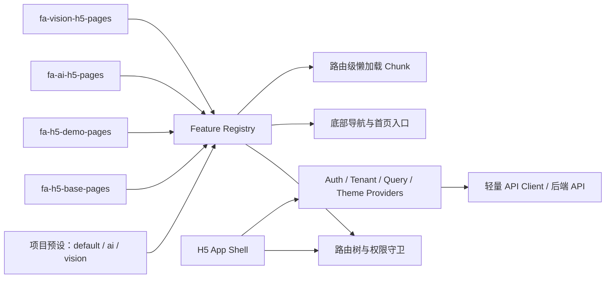

# FA H5 实施方案与 Roadmap

## 文档信息

| 项目 | 内容 |
|---|---|
| 文档状态 | Roadmap Active（M2 In Progress） |
| 目标应用 | `frontend/apps/h5` |
| 基准日期 | 2026-07-23 |
| 当前阶段 | M2 模块装配 Beta（In Progress） |
| 目标 | 建设面向手机端的管理操作应用，并支持业务 Feature 按项目自由组合和按需构建 |
| 经验基线 | Portal Phase 0～6 已验证架构、性能、发布与工程化实践 |

> 本文是 H5 建设的主方案和阶段管理基线。阶段范围、关键技术决策或验收口径发生变化时，应先更新本文，再开始相关实现。
>
> 2026-07-23 已将 Portal 实施过程中的可复用结论整合到 H5 方案。H5 是登录后管理应用，不照搬 Portal 的官网预渲染和公开注册场景；新增的账号边界、性能预算、代理防错、生产门禁和工程化要求已完成 M0 增量签署。

## 1. 背景与目标

`frontend/apps/h5` 当前是独立的 React/Vite 应用骨架，生产访问前缀为 `/h5/`，并已纳入 Maven/JAR 的前端构建和静态资源发布流程。下一步需要将其建设为面向手机端的后台管理入口，同时形成类似 `frontend/apps/admin/features` 的业务模块目录结构。

本项目需要同时实现三种分包能力：

1. **源码分包**：不同业务模块位于独立 Feature 目录，目录内聚页面、类型、服务和组件。
2. **项目分包**：项目通过显式配置选择业务 Feature，未选择模块不进入路由和构建依赖图。
3. **运行时分包**：页面采用路由级懒加载，进入页面时才加载对应 Chunk。

### 1.1 建设目标

- 提供适用于手机浏览器的管理操作页面。
- 支持登录、用户、租户、权限、导航、异常处理等公共能力。
- 支持简单 CRUD、状态处理、消息、待办等高频移动管理场景。
- 支持不同项目通过项目预设自由组合业务 Feature。
- 保持 Feature 边界清晰，降低复制、删除和跨项目迁移成本。
- 复用现有 `base_user` 账号和 Admin 授权体系，不建立第二套 H5 用户身份。
- 通过可量化包体预算、模块图和移动端指标保持首屏轻量。
- 延续现有 `/h5/` 部署方式和 Maven/JAR 发布链路。

### 1.2 非目标

- 首期不追求把所有 Admin 页面响应式改造成 H5 页面。
- 首期不移动化工作流编辑器、视觉标注、3D、大型报表和复杂配置页。
- 首期不引入 Module Federation 或独立部署的微前端体系。
- 首期不建设离线优先 PWA；仅预留后续扩展能力。
- 不直接复用 Admin 的桌面表格、拖拽弹窗和菜单标签页交互。

## 2. 仓库现状

### 2.1 已具备能力

- `frontend/apps/h5/package.json` 已注册为 workspace 包 `@fa/h5`。
- `frontend/apps/h5/vite.config.ts` 已设置生产资源前缀 `/h5/` 和开发端口 `9002`。
- `frontend/package.json` 已提供 `dev:h5`，并将 H5 纳入 `build:apps`。
- `fa-admin/pom.xml` 已将 `apps/h5/dist` 复制到 JAR 的 `static/h5`。
- `SpaErrorController` 已处理 `/h5` 尾斜杠跳转、静态资源 404 和 `/h5/**` SPA 深链接回退。
- Admin 已形成 `features/<feature>/pages|services|types|configs` 的业务目录惯例。

### 2.2 当前缺口

- H5 只有启动示例，没有路由、鉴权、权限、状态管理和移动组件体系。
- H5 缺少带 `basename="/h5"` 的 Router；正式增加前端路由后必须配置。
- H5 当前只在 production 使用 `/h5/` base、development 使用 `/`，需要统一路径语义并验证本地深链接。
- H5 Vite proxy 直接读取 `process.env.VITE_APP_BASE_URL`，且错误回退到 `http://localhost:8080`；仓库开发后端实际使用 `http://127.0.0.1/`。需要改为 `loadEnv()`、环境类型、显式默认值和代理连通性检查。
- Admin 使用 `vite-plugin-pages` 扫描全部 `features/*/pages`，中央 `services.ts`、`types.ts`、`configs.ts` 又显式聚合全部模块。这能实现目录隔离，但不能保证未选模块不进入项目依赖图。
- Admin Feature 内仍存在 `pages/h5` 历史页面，生产 `/h5/**` 已由独立 H5 应用承接，需要迁移和兼容重定向。
- `@fa/ui` 内的请求、Token 和 `BaseApi` 能力与桌面 UI、浏览器全局变量存在耦合，不适合被 H5 整包依赖。

### 2.3 Portal 实施后确认的可复用结论

| Portal 已验证经验 | H5 中的落地方式 |
|---|---|
| 独立应用比在 Admin 中继续堆叠依赖更容易控制首屏 | H5 保持独立 React/Vite 入口、移动 UI、路由和依赖图 |
| Profile 静态 import 可以让未启用 Feature 被 Vite 裁剪 | H5 Project 必须静态 import Feature，运行时禁止 `import.meta.glob` 全量发现 |
| Feature 契约必须在开发和构建阶段检查冲突 | H5 Registry/Composer 阻断重复 ID、路径、导航、缺失依赖和循环依赖 |
| 同一自然人不应因为应用入口不同拥有两套账号 | H5 与 Admin 复用 `base_user`、Token、租户和 RBAC，不增加 `base_user_h5` 或 `h5_enabled` |
| 应用级资格和业务权限是两层边界 | H5 属于管理应用，先校验账号有效和 `admin_enabled = 1`，再校验现有 RBAC/数据权限 |
| 开发代理端口错误会表现为 Vite 空白 `text/plain 500` | 默认代理与 Spring 开发端口保持一致，并增加代理冒烟检查，响应必须来自后端 JSON |
| SPA fallback 不能吞掉缺失静态资源 | 只对有效页面深链接回退；JS、CSS、图片、字体、`.data` 和 `/api/**` 保持真实状态码 |
| “按需组合”需要产物证据，而不是只看目录 | 生成客户端模块图，CI 断言未启用 Feature 不进入模块和产物 |
| 性能预算必须有目标值和硬上限 | H5 对初始 JS/CSS、最大异步 Chunk、图片和移动端 Web Vitals 建立门禁 |
| Feature 删除必须有兼容窗口和项目确认 | H5 增加 `active/deprecated` 生命周期、迁移说明和 Project 显式确认 |
| 只有一个真实消费方时提前抽 workspace package 收益有限 | 先保留 H5 `platform/shared`，出现第二个独立应用和稳定 API 后再抽包 |

Portal 的“官网公开内容预渲染”不直接迁移到 H5。H5 首期内容都依赖登录态、权限和实时数据，采用轻量 CSR；如果未来出现公开帮助页、分享页或营销落地页，应独立评估是否交给 Portal，或仅对明确公开路由预渲染。

## 3. 核心架构决策

### 3.1 总体架构



采用“独立 H5 SPA + 显式 Feature Manifest + 项目预设 + 路由懒加载”模式：

- H5 与 Admin 保持独立入口、路由、依赖和 UI 体系。
- Feature 通过 Manifest 向宿主贡献路由、导航和首页入口。
- 项目预设显式 import 需要的 Feature。
- Vite 在构建时将 `@project` 指向唯一项目预设，保证未启用 Feature 不进入依赖图。
- Feature 页面使用动态 import，形成路由级异步 Chunk。

### 3.2 为什么不直接复制 Admin 装配方式

Admin 当前的文件扫描适合单一、全量后台应用，但不适合严格的项目裁剪：

- Feature 目录存在即可能被路由扫描。
- 中央 barrel 需要手工同步增删。
- 全局配置通过 merge 聚合，冲突只能在运行时发现。
- Feature 容易通过 `@/services`、`@/types` 隐式依赖其他业务模块。

H5 从零建设时应采用显式装配，牺牲少量注册代码，换取可分析的依赖图、确定的构建结果和明确的模块边界。

### 3.3 为什么首期不采用微前端

当前模块共享 React、构建工具、发布流程和后端服务，暂时没有独立部署或独立运行时升级需求。微前端会额外引入共享依赖、版本兼容、鉴权通信、样式隔离和部署治理成本。显式 Feature 组合已经能够满足当前项目自由组合需求。

### 3.4 账号与应用访问边界

H5 是 Admin 的移动管理入口，不是 Portal 的公开用户入口，因此账号与权限采用以下模型：

```text
base_user 登录认证
  -> 账号状态有效
  -> admin_enabled = 1
  -> 租户有效
  -> RBAC 接口/按钮/数据权限
```

- H5 与 Admin 使用同一张 `base_user` 表和同一个 `Authorization` Token。
- 不新增 H5 用户表、账号映射表、`h5_enabled` 字段或第二套用户中心。
- H5 不提供公开自助注册；账号开通和 `admin_enabled` 授权继续由 Admin 管理。
- 用户在 Admin 与 H5 之间感知为同一账号和共享会话，退出任一端会使服务端 Token 失效。
- H5 专用聚合接口可以使用 `/api/h5/**`，但仍执行 `admin_enabled + RBAC`；复用既有业务接口时保留原路径，不为了前端入口复制 Controller。
- 只有未来产品明确要求“H5 可访问但 Admin 不可访问”的独立资格时，才重新评审应用授权模型。

`admin_enabled` 只表示能否进入管理应用，不能替代角色、菜单、按钮和数据范围权限。后端仍是最终边界，前端路由和按钮隐藏只负责用户体验。

### 3.5 渲染与路由模式

- 首期使用 React Router `8.3.0` Data Mode 和 CSR，`basename="/h5"`。
- H5 不启用全站 SSR/预渲染：登录态、租户和权限决定页面内容，SEO 不是目标。
- 路由级 `lazy` 负责运行时拆包，Project 对 Feature 的静态 import 负责项目级源码裁剪。
- 登录页只保留轻量静态壳，不在首屏加载任一业务 Feature 页面。
- 如果未来出现无需登录、需要搜索收录或社交分享的公开内容，优先放入 Portal；确需位于 H5 时再为明确路由增加预渲染，不扩大到受保护页面。
- React Router 升级必须同时验证 Node engine、路由类型、深链接、basename 和生产 fallback；CI 固定满足依赖要求的 Node 版本。

## 4. 目录规划

### 4.1 H5 应用目录

```text
frontend/apps/h5/
├── docs/
│   ├── h5-implementation-plan-and-roadmap.md
│   ├── feature-catalog.generated.md
│   ├── feature-lifecycle.md
│   ├── adr/
│   └── m0/
├── scripts/
│   ├── create-feature.ts
│   ├── create-project.ts
│   ├── check-boundaries.ts
│   ├── validate-project-matrix.ts
│   └── generate-feature-catalog.ts
├── src/
│   ├── main.tsx
│   ├── app/
│   │   ├── bootstrap.tsx
│   │   ├── providers.tsx
│   │   ├── router.tsx
│   │   └── error-boundary.tsx
│   ├── projects/
│   │   ├── default.ts
│   │   ├── ai.ts
│   │   └── vision.ts
│   ├── platform/
│   │   ├── feature/
│   │   ├── auth/
│   │   ├── permission/
│   │   ├── tenant/
│   │   └── http/
│   ├── layouts/
│   └── shared/
│       ├── components/
│       ├── hooks/
│       ├── styles/
│       └── types/
├── features/
│   ├── fa-h5-base-pages/
│   ├── fa-h5-demo-pages/
│   ├── fa-ai-h5-pages/
│   └── fa-vision-h5-pages/
├── tests/
├── index.html
├── package.json
├── tsconfig.json
└── vite.config.ts
```

目录按阶段和实际需求创建，不预建空目录。

`scripts` 可以在工程阶段自动发现 Feature/Project 并生成目录文档，但应用运行时代码不得使用通配扫描替代 Project 的静态 import。

### 4.2 Feature 目录

```text
features/fa-xxx-h5-pages/
├── index.ts                 # Feature 公共出口
├── feature.ts               # Feature Manifest
├── routes.tsx               # 路由定义和页面懒加载
├── configs/                 # 网关和模块配置
├── types/                   # Entity、请求、响应、枚举
├── services/                # 每个后端资源一个 service
├── queries/                 # 服务端状态 Query/Mutation hooks
├── pages/                   # 路由页面
├── components/              # 模块内跨页面复用组件
├── styles/                  # 模块级样式和 Token 扩展
├── tests/                   # 模块级单测
└── README.md                # 公开契约、依赖、接口、性能和迁移说明
```

约束如下：

- 页面专用组件放在对应页面目录内。
- Feature 只从 `index.ts` 暴露公共 API。
- 跨 Feature 依赖只能引用对方公共出口。
- Feature 不得从 H5 `src` 的业务实现中深层导入。
- 通用能力进入 `platform` 或 `shared`，业务能力保留在 Feature。
- `configs`、`services`、`types` 在 Feature 内聚合，不建立 H5 全量业务 barrel。
- Feature 不读取 `VITE_APP_PROJECT`、Project 文件或项目品牌配置；项目差异通过显式配置注入。
- Feature README 必须记录公开路由、权限、接口、依赖、性能注意项和生命周期。

## 5. Feature 契约与项目装配

### 5.1 Feature Manifest

建议的最小契约：

```ts
type H5FeatureLifecycle =
  | { status: 'active' }
  | {
      status: 'deprecated';
      since: string;
      reason: string;
      migrationGuide: string;
      replacementFeatureId?: string;
      removalVersion?: string;
    };

interface H5Feature {
  id: string;
  order?: number;
  dependsOn?: string[];
  routes: H5Route[];
  navItems?: H5NavItem[];
  homeEntries?: H5HomeEntry[];
  lifecycle?: H5FeatureLifecycle;
}

interface H5FeatureMigration {
  featureId: string;
  acknowledgedIn: string;
  targetFeatureId?: string;
}

interface H5Project {
  id: string;
  features: readonly H5Feature[];
  featureMigrations?: readonly H5FeatureMigration[];
}
```

路由元数据至少包含：

- 稳定且唯一的 route ID。
- 路由 path。
- 懒加载页面组件。
- 是否需要登录。
- 所需权限标识。
- 页面标题。
- 是否显示底部导航。
- 返回策略和必要的滚动恢复策略。

### 5.2 项目预设

项目预设显式选择 Feature：

```ts
export default defineH5Project({
  id: 'ai-project',
  features: [baseFeature, aiFeature],
});
```

Vite 使用 `loadEnv()` 读取 `VITE_APP_PROJECT`，校验项目名后，把 `@project` 解析到 `src/projects/<project>.ts`。禁止直接将未经校验的环境变量拼入任意文件路径。

Project 是 H5 对 Portal Profile 思路的适配：它只描述站点/品牌配置、默认路由和 Feature 组合。Project 必须对 Feature 使用静态 import，禁止 `import.meta.glob`、运行时读取目录后再筛选，禁止通过全量业务 barrel 间接导入所有 Feature。

Project 继续启用 deprecated Feature 时必须通过 `featureMigrations` 明确记录确认版本和迁移目标；确认只表示项目负责人知晓迁移责任，不消除构建 warning。新 Project 脚手架默认拒绝 deprecated Feature。

如果未来需要在同一服务器同时托管多个项目版本，再扩展为：

- `base: /h5/<project>/`
- `outDir: dist/<project>`
- CI 项目构建矩阵

首期默认一个构建产物只对应一个项目预设。

### 5.3 Registry 校验

开发启动和构建阶段必须校验：

- Feature ID 不重复。
- route ID 和完整 path 不重复。
- nav key、home entry key 不重复。
- `dependsOn` 指向已启用 Feature。
- 权限标识格式合法。
- 导航入口能解析到已注册路由。
- Feature 依赖不存在循环。
- deprecated Feature 具备开始版本、原因和迁移文档。
- Project 启用 deprecated Feature 时存在有效迁移确认，迁移目标已启用且与替代声明一致。

Composer 输出必须冻结，并包含启用 Feature、路由、导航、首页入口和生命周期 warning。生产运行时只消费已经验证的 Registry，不通过静默覆盖解决冲突。

## 6. 移动端产品与交互规范

### 6.1 页面适配分级

| 等级 | 场景 | 策略 |
|---|---|---|
| A | 消息、待办、审批、状态变更、简单 CRUD | 优先移动化 |
| B | 筛选项较多、分步表单、少量批量操作 | 重新设计交互后移动化 |
| C | 工作流编辑、视觉标注、3D、大型表格、复杂系统配置 | 首期保留桌面端 |

### 6.2 CRUD 交互映射

| Admin 桌面交互 | H5 交互 |
|---|---|
| 数据表格 | 卡片列表或紧凑 List |
| 分页器 | 加载更多或无限滚动 |
| 横向查询表单 | 搜索框 + 筛选 Popup |
| DragModal 表单 | 独立全屏表单页或 Bottom Sheet |
| 表格操作列 | 详情页底部固定操作栏 |
| 多列表格列 | 只显示关键摘要，完整字段进入详情页 |
| 批量操作 | 慎用；确有高频需求时进入显式选择模式 |

### 6.3 移动 UI 基线

- 默认采用 Ant Design Mobile，Admin 继续使用桌面版 Ant Design。
- 适配 `env(safe-area-inset-*)` 和 `100dvh`。
- 主要验证 375×667、390×844、430×932 及平板视口。
- 关键操作按钮满足触控尺寸和间距要求。
- 页面必须提供 loading、empty、error 和 forbidden 状态。
- 表单需要防止重复提交，并对未保存离开提供提示。
- 删除、启停、审批等高风险操作必须二次确认。
- 优先使用 CSS 变量和主题 Token，不在业务页面全局覆盖组件库选择器。

### 6.4 移动端加载策略

- App Shell、登录页和会话恢复只加载平台内核，不静态导入业务页面。
- 首屏不得预加载全部 Project Feature；只允许预取用户下一步高概率访问的小型路由 Chunk。
- 图片必须声明尺寸，优先 WebP/AVIF，并对列表图片使用懒加载。
- 长列表优先分页或限制缓存页数；达到真实性能瓶颈后再引入虚拟列表。
- 弱网下保留骨架、重试和幂等提交状态，不能用无限 Loading 掩盖接口错误。
- 需要拍照、上传或定位的页面必须在真机验证权限拒绝、后台恢复和大文件失败。

## 7. 路由、导航与权限

### 7.1 路由规范

- 应用 Router 设置 `basename="/h5"`。
- 公开路由示例：`/login`、`/auth/callback`。
- 登录后路由示例：`/app/home`、`/app/me`。
- 业务路由示例：`/app/vision/projects/:id`。
- H5 内部路径不再使用 `/admin` 前缀。
- 提供 H5 自有 404、无权限和全局异常页面。

### 7.2 导航模型

- 底部导航只承载 3～5 个一级高频入口。
- 更多业务入口通过首页宫格、工作台或“更多”页面承载。
- 导航项由 Feature Manifest 提供，由 Registry 按权限和顺序合并。
- 页面局部 Tabs 与底部导航分开管理。
- 不照搬 Admin 的多标签页菜单模型。

### 7.3 权限模型

- route meta 声明登录要求和权限标识。
- 登录和每个受保护请求先经过管理应用准入校验：账号有效且 `admin_enabled = 1`。
- 导航、首页入口和操作按钮使用同一权限判断服务。
- 前端隐藏只负责用户体验，后端仍是最终授权边界。
- 直接访问无权限深链接时进入 403 页面，不回退成 404。
- 租户切换后清理服务端缓存并重新获取用户、角色和权限。
- 管理员关闭 `admin_enabled` 后，存量 Token 的下一次 H5/Admin 请求必须立即失败，不能只在登录时检查。

## 8. API、鉴权和共享代码

### 8.1 轻量 API Client

H5 首期不直接依赖整个 `@fa/ui`。M1 先在 H5 `src/platform/http` 实现轻量请求层；出现 Admin 或第二个应用的真实复用需求后，再通过独立 ADR 提取为 workspace 包。

API Client 负责：

- 默认使用原生 `fetch + AbortController` 和统一响应结构，避免仅为拦截器引入整套客户端；确需 Axios 时记录包体收益评估。
- `BaseApi<Entity, Key>` 等通用 CRUD 方法。
- Token、租户、客户端来源和版本 Header。
- 401、403、超时、网络错误和请求取消。
- 下载、上传和普通 JSON 请求。
- 通过适配器注入 Storage、跳转和错误提示，避免依赖具体 UI。
- 兼容后端 `Ret<T>` envelope，并在平台层统一规范化，Feature 不重复猜测 `data/message/code` 格式。

API Client 不负责：

- 页面 Toast 文案。
- 路由组件渲染。
- Feature 业务状态。
- 特定业务 DTO。

### 8.2 Admin/H5 复用边界

可以复用：

- `@fa/core` 中稳定的基础 DTO、枚举和分页类型。
- H5 `platform/http` 的轻量请求层；提取 workspace 包后的共享 API Client。
- 从真实共享需求中提取的 `@fa/<domain>-contracts`。
- 无 UI 依赖的校验和数据转换工具。

不直接复用：

- Admin 页面 JSX。
- `BaseBizTable`、`DragModal` 和桌面布局。
- Admin 菜单标签页 Context。
- 依赖 Admin `@/services`、`@/types` 的业务实现。

现有 Admin service 继续工作，新开发或被 H5 使用的资源再按需提取共享契约，避免一次性大规模迁移。

### 8.3 鉴权安全

- 提供登录、退出、会话恢复和 401 回跳流程。
- 不在 URL 中传递长期 Token。
- MVP 兼容现有同源 localStorage 的 `Authorization` Token，但只能通过平台 `TokenStore` 访问。
- H5 账号密码登录复用 Admin 登录接口和 `base_user`，登录成功必须满足 `admin_enabled = 1`；不新增 H5 注册接口。
- MVP 不启用 SSO；未来外部登录必须使用一次性 code 换 Token，并立即从地址栏移除 code。
- 短期 access token + HttpOnly refresh cookie 作为后续安全演进方向，需要新的后端契约和 ADR。
- 禁止把密钥、私钥或服务端凭证放入 `VITE_APP_*`。
- 日志和监控不得记录 Token、密码和敏感请求体。

### 8.4 API 路径与开发代理

- 浏览器业务请求统一使用同源相对地址 `/api/...`，生产环境不把内网后端地址打入 Bundle。
- H5 专属聚合接口使用 `/api/h5/**`；复用现有 Admin 业务 API 时保留原前缀和权限拦截器。
- `/api/h5/**` 默认属于管理接口，不能因为路径带 `h5` 就加入公开 allowlist。
- Vite 只在开发环境代理 `/api`，代理目标来自 `loadEnv()`；仓库默认开发目标为 `http://127.0.0.1/`，项目可以通过 `VITE_APP_BASE_URL` 覆盖。
- 启动冒烟检查至少请求一个无需有效 Token 即可观察状态码的接口。连接正常时应得到 Spring JSON 的 2xx/401/403；Vite 空白 `text/plain 500` 视为代理目标或后端进程故障。
- 切换 `VITE_APP_BASE_URL` 后必须重启或确认 Vite 已重新加载配置。

## 9. 状态与数据获取

M0 冻结以下状态分层：

- **服务端状态**：TanStack Query，负责缓存、失效、刷新、Mutation 和无限列表。
- **应用状态**：首期使用 React Context 保存会话、当前租户、主题和项目配置；出现可证明的跨 Provider 复杂状态后再评估 Zustand。
- **页面状态**：React 本地状态和表单状态。
- **可恢复筛选条件**：URL search params。

约束：

- Query Key 必须包含 Feature 命名空间和影响数据的参数。
- Mutation 成功后只失效明确相关的 Query。
- 删除、审批等不可逆操作不默认做乐观更新。
- 无限列表限制内存中保留的页数，避免长列表无限增长。
- 不使用全局事件总线模拟请求/响应流程。
- 首期不持久化服务端 Query Cache；PWA/离线能力单独立项。

## 10. 样式与主题

- 建立 H5 独立 Token，例如 `--fa-h5-color-primary`、`--fa-h5-page-bg`、`--fa-h5-content-padding`。
- 将品牌主色映射到 Ant Design Mobile Token，不直接覆盖全局内部选择器。
- 同时设计亮色和暗色所需的文本、边框、背景、hover、active 和 disabled 状态。
- 通用图标优先复用 `@fa/icons` 或已安装的具体 Iconify 集合。
- Feature 样式不得污染其他 Feature；可复用规则进入 H5 shared styles。
- 首期不为了登录背景引入 Three、Vanta 等大型依赖。

## 11. 构建、部署和可观测性

### 11.1 Vite

- 使用 `loadEnv(mode, H5 应用根目录, '')` 加载环境变量，不在配置阶段直接读取尚未注入的 `process.env.VITE_APP_*`。
- `VITE_APP_PROJECT` 必须通过 kebab-case 和文件存在性校验后才能解析 Project，禁止任意路径拼接。
- `/api` 开发代理默认指向 `http://127.0.0.1/`，允许环境覆盖，并通过 JSON 响应冒烟检查防止端口漂移。
- 开发和生产统一使用 `/h5/` base，减少路径差异。
- 设置 `@`、`@features`、`@project` 和必要的平台别名，并同步 `tsconfig` paths。
- 页面必须采用动态 import。
- 初期使用 Vite 默认 Chunk 策略，基于产物分析后再配置 `manualChunks`。
- 新增 `check`、`lint` 和目标测试脚本，纳入 Turbo 任务。

### 11.2 性能与构建门禁

M1 先测量空壳、登录页和 App Shell 基线；M2 在真实路由、Ant Design Mobile 和 TanStack Query 接入后冻结最终预算。冻结前使用以下初始门槛：

| 指标 | 目标值 | 硬上限 | 口径 |
|---|---:|---:|---|
| 登录页初始 JavaScript | ≤ 150 KiB | 180 KiB | gzip，总和 |
| 登录页初始 CSS | ≤ 30 KiB | 40 KiB | gzip，总和 |
| 最大业务异步 Chunk | ≤ 100 KiB | 150 KiB | gzip，单文件 |
| 首屏最大图片 | ≤ 200 KiB | 300 KiB | 原始文件 |
| LCP | ≤ 2.5 s | 4.0 s | 约定移动设备/网络，P75 |
| INP | ≤ 200 ms | 500 ms | P75 |
| CLS | ≤ 0.1 | 0.25 | P75 |

构建必须生成或验证：

- 当前 Project ID、Feature ID 清单、路由清单和 Git/应用版本。
- 客户端模块图；出现 Admin 源码、桌面 Ant Design、未启用 Feature 或禁止依赖时失败。
- `build-report.json`，包含初始资源、最大 Chunk、预算结果、warning 和 error。
- 每个典型 Project 的独立生产构建，输出目录隔离，避免共享生成文件并发竞争。
- 预算超过目标值产生 warning，超过硬上限阻断构建。

### 11.3 发布

- 继续通过 `frontend build:apps` 和 Maven `prepare-package` 打入 JAR。
- 验证 H5 构建目录最终进入 JAR 的 `static/h5`，不能只验证本地 `dist`。
- `/h5` 重定向到 `/h5/`；有效 SPA 深链接回退到 H5 `index.html`。
- `/h5/assets/**`、图片、字体、`.data` 和不存在的带扩展名资源必须返回真实 404，不能回退 HTML。
- `/api/**` 永远不进入 H5 SPA fallback。
- `index.html` 使用不缓存或短缓存策略。
- 带 hash 的 `/h5/assets/*` 使用长期 immutable 缓存。
- 网关或 Spring 至少启用 gzip；Brotli 由目标 Nginx/CDN 验收。
- CSP、第三方脚本、上传/下载和外部资源域名进入发布检查清单。
- 构建信息应记录项目预设、启用 Feature、Git commit 和应用版本。
- 发布顺序先上传新 hash 资源，再切换 HTML/JAR；回滚必须同时恢复匹配的 HTML 和静态资源。
- 保留可快速回滚的上一版本 JAR/镜像。

### 11.4 监控

- H5 使用独立应用标识、环境和 release 初始化错误监控。
- 捕捉 JS 异常、资源加载失败、接口错误率和关键流程失败。
- 区分后端业务错误、401/403、代理连接失败、Chunk 加载失败和客户端异常。
- 记录 Project、Feature、路由和 release，但不记录 Authorization Header。
- 不直接复制 Admin 中的占位 DSN。
- 核心业务操作记录可追踪业务 ID，但不记录敏感字段。

## 12. 历史 H5 页面迁移

当前 Admin Feature 中的历史页面至少包括：

- `frontend/apps/admin/features/fa-admin-pages/pages/h5.tsx`
- `frontend/apps/admin/features/fa-admin-pages/pages/h5/in.tsx`
- `frontend/apps/admin/features/fa-admin-demo-pages/pages/h5/in/demo/userinfo/index.tsx`

详细映射、Token 风险和删除窗口见 [M0 历史 H5 路由迁移清单](m0/legacy-h5-route-migration.md)。

迁移策略：

1. 在独立 H5 中实现登录后 AppShell 和用户信息页。
2. 为仍在使用的 `/h5/in/**` 地址提供临时重定向。
3. 统计线上访问和外部链接来源。
4. 完成调用方切换后删除 Admin 内历史 H5 页面。
5. 在回归中验证 Admin 根路由与 H5 `/h5/**` 不再存在职责重叠。

## 13. Roadmap

以下按 1 名前端主力、后端和测试兼职支持估算。M4 完成后形成可演示 MVP，M5 完成后形成生产基线，M6 完成后具备规模化复制门禁，总周期预计 9～11 周。

### 13.1 里程碑总览

| 项目指标 | 当前值 | 完成判定 |
|---|---|---|
| 整体项目状态 | In Progress | M0～M6 全部为 `Completed` 时，首期建设项目完成 |
| 已完成阶段 | 1/7 | 已完成 M0；M1、M2 正在推进 |
| MVP 进度 | 1/5 | M0～M4 全部为 `Completed` 时，MVP 完成 |
| GA 进度 | 1/6 | M0～M5 全部为 `Completed` 时，GA 完成 |
| 持续演进 | M7 Not Started | M7 是 GA 后持续工作，不阻塞首期项目完成 |
| 最后更新 | 2026-07-23 | 每次阶段状态、任务或验收结果变化时同步更新 |

| 阶段 | 任务进度 | 状态 | 预计周期 | 目标 |
|---|---:|---|---:|---|
| M0 架构冻结 | 12/12 | Completed | 3～5 天 | 架构、账号、性能和发布边界已冻结 |
| M1 平台骨架 Alpha | 7/8 | In Progress | 5～7 天 | 建立可运行、可导航、可请求的 H5 基座 |
| M2 模块装配 Beta | 7/8 | In Progress | 5～8 天 | 实现项目预设和严格按需 Feature 组合 |
| M3 移动管理基础 MVP | 0/7 | Not Started | 7～10 天 | 完成登录、租户、权限、工作台等基础闭环 |
| M4 CRUD 纵向试点 | 0/6 | Not Started | 8～12 天 | 验证移动 CRUD 并落地首个真实业务模块 |
| M5 性能与生产化 GA | 0/7 | Not Started | 5～8 天 | 完成性能、测试、监控、发布和回滚能力 |
| M6 工程化增强 | 0/8 | Not Started | 3～5 天 | 建立脚手架、目录、生命周期和典型组合 CI |
| M7 规模化推进 | 0/6 | Not Started | 持续 | 按业务价值迁移更多 Feature |

状态定义和更新规则：

- `Not Started`：阶段任务尚未开始，所有任务保持未勾选。
- `In Progress`：至少一项任务已完成，但任务或验收门槛尚未全部满足。
- `Ready for Acceptance`：任务已全部完成，等待 Demo、业务或目标环境验收。
- `Completed`：任务和验收门槛全部勾选，并写明当前阶段结论和完成日期。
- `Blocked`：存在阻断阶段推进的外部依赖，必须在阶段结论中记录 Owner、原因和解除条件。
- “任务进度”只统计各阶段“任务”清单；验收清单单独决定能否从 `Ready for Acceptance` 更新为 `Completed`。
- 更新阶段复选框后，必须同步本节的任务进度、阶段状态、整体项目状态和最后更新日期，避免总览与明细漂移。

### 13.2 M0：架构冻结

目标：冻结 H5 应用、Feature 组合、账号权限、性能和发布边界，为后续阶段提供可执行基线。

任务：

- [x] 完成 [M0 交付包与签署清单](m0/README.md)。
- [x] 完成 [ADR-0001：H5 应用与 Feature 组合架构](m0/adr/0001-h5-application-and-feature-architecture.md)。
- [x] 冻结 [Feature Manifest 和项目预设接口契约](m0/feature-and-project-contract.md)。
- [x] 冻结 [路由、导航、权限和目录命名规范](m0/routing-navigation-permission-and-naming.md)。
- [x] 完成 [移动页面 A/B/C 适配清单](m0/mobile-page-adaptation-matrix.md)。
- [x] 确认 [首个真实业务试点：个人消息中心](m0/pilot-message-center.md)。
- [x] 完成 [ADR-0002：Token 存储和 SSO](m0/adr/0002-auth-session-and-sso.md)。
- [x] 完成 [历史 `/h5/in/**` 路径迁移清单](m0/legacy-h5-route-migration.md)。
- [x] 冻结 [性能、构建与生产验收基线](m0/performance-build-and-production-baseline.md)。
- [x] 确认账号和应用授权：复用 `base_user`，使用 `admin_enabled + RBAC`，不新增 H5 用户表或资格字段。
- [x] 冻结性能预算、模块图、SPA fallback、缓存和开发代理验收口径。
- [x] 将 Portal 经验增量决策同步回 M0 Feature/Auth ADR 和接口契约。

验收门槛：

- [x] 所有 P0 技术决策有明确结论和负责人。
- [x] 首个试点模块不存在未确认的关键后端依赖。
- [x] Product/后端确认 H5 是 Admin 移动管理入口，不提供 Portal 式自助注册。
- [x] 前端/运维确认 `/h5/`、`/api`、开发代理和 JAR 静态资源目录。
- [x] 测试确认 provisional 性能预算与目标移动设备/网络口径。
- [x] Product、前端、后端和测试对 MVP 范围达成一致。

当前阶段结论：M0 已于 2026-07-23 完成。增量决策已同步到 Feature/Auth ADR、接口契约和生产验收基线；完成依据、源码核验范围和后续实现项见 [M0 完成记录](m0/README.md#完成记录)。M0 完成只代表技术基线冻结；M1、M2 的当前状态以本 Roadmap 总览和对应实施记录为准。

### 13.3 M1：平台骨架 Alpha

目标：建立可运行、可导航、可请求并具备移动端基础体验的 H5 平台骨架。

任务：

- [x] 接入 React Router `8.3.0` Data Mode、`basename="/h5"` 和基础路由树。
- [x] 固定满足 React Router/Vite engine 的 Node 版本；CI 至少使用 `22.22.0`，本地低版本直接提示。
- [x] 实现 AppShell、Providers、全局异常页和页面 Loading。
- [x] 接入 Ant Design Mobile、H5 Token、安全区和基础布局。
- [x] 实现 `loadEnv()`、环境变量类型、`/api` proxy 和代理冒烟脚本。
- [x] 实现 API Client 初版、统一错误处理和请求 Header。
- [ ] 测量空壳、登录页和 App Shell 性能基线。
- [x] 增加 `check`、`lint` 和开发脚本。

验收门槛：

- [x] `/h5/`、公开页、登录页和任意深链接能正确加载。
- [ ] 开发和 JAR 部署下的静态资源路径一致。
- [x] `/api` 能透传到配置的 Spring 后端；无 Token 冒烟返回后端 JSON 401，而不是 Vite 空白 500。
- [x] 401、403、404、网络错误有明确状态页面。
- [ ] 登录页不包含业务 Feature 页面模块，初始资源未超过 provisional 硬上限。
- [x] 相关文件通过局部 typecheck/lint。

当前阶段结论：`In Progress`，任务进度 7/8。平台代码和开发环境验证已完成；production 性能基线与 JAR 静态资源验收尚未执行，详见 [M1 平台骨架 Alpha 实施记录](m1/platform-alpha.md)。

### 13.4 M2：模块装配 Beta

目标：实现 Feature、Project、Registry 和构建裁剪，使不同项目能够可靠组合业务模块。

任务：

- [x] 实现 `H5Feature`、`H5Project` 和 Registry。
- [x] 实现 `@project` 构建时别名和项目名校验。
- [x] 实现 Feature 依赖、路由和导航冲突检查。
- [x] 实现 Project 静态 import 和依赖边界检查，禁止运行时全量扫描。
- [x] 建立 `fa-h5-base-pages`。
- [x] 建立 `fa-h5-demo-pages` 和可复制的 Feature 示例。
- [ ] 实现路由级动态 import 和 Chunk 验证。
- [x] 自动生成 Feature/Project 目录文档和客户端模块图。

验收门槛：

- [x] 至少存在两个项目预设，且启用 Feature 集不同。
- [ ] 未启用 Feature 不出现在路由和构建产物中。
- [x] Feature 可通过只修改项目预设完成启用/禁用。
- [ ] 模块图证明未启用 Feature、Admin 源码、桌面 Ant Design 和 `@fa/ui` 不在客户端依赖中。
- [x] 路由或 Feature 冲突会在开发/构建阶段失败，而不是运行时静默覆盖。

当前阶段结论：`In Progress`，任务进度 7/8。模块装配代码、工程门禁和两个项目的开发态浏览器验证已完成；按照仓库约定未执行完整 production build，因此异步 Chunk 与客户端模块图产物尚未完成最终证明，详见 [M2 模块装配 Beta 实施记录](m2/module-composition-beta.md)。M1 的 production 性能/JAR 验收缺口仍独立保留，不因 M2 开发而自动完成。

### 13.5 M3：移动管理基础 MVP

目标：完成登录、租户、权限、工作台和个人入口，形成移动管理基础闭环。

任务：

- [ ] 实现登录、退出、会话恢复和登录后回跳。
- [ ] 接入 `base_user` 共享账号和 `admin_enabled` 管理应用准入。
- [ ] 实现当前用户、角色和权限加载。
- [ ] 实现租户列表、当前租户和租户切换。
- [ ] 实现权限路由守卫、导航过滤和操作权限组件。
- [ ] 实现首页/工作台、底部导航、个人中心和消息入口。
- [ ] 建立 Query Client、应用状态和缓存清理规则。

验收门槛：

- [ ] 登录、退出、刷新恢复和 401 失效闭环正常。
- [ ] `admin_enabled = 0` 的用户不能登录或继续调用 H5 管理接口；重新开启后仍需通过 RBAC。
- [ ] Admin/H5 共享 Token 的登录、退出和失效行为与产品文案一致。
- [ ] 租户切换后数据、权限和导航正确刷新。
- [ ] 无权限用户不能通过 UI 或深链接进入受限页面。
- [ ] 主流移动视口无关键布局问题。

当前阶段结论：`Not Started`。M2 完成后启动。

### 13.6 M4：CRUD 纵向试点

建议先使用 Student API 完成技术纵向切片，再实施一个真实低风险业务模块。

目标：验证适用于手机端的 CRUD 模式，并交付首个可验收的真实业务 Feature。

任务：

- [ ] 实现卡片列表、搜索、筛选、加载更多和下拉刷新。
- [ ] 实现详情页、新增页、编辑页和删除确认。
- [ ] 实现字典、日期、选择器、表单校验和提交防重。
- [ ] 实现保存后缓存失效和列表刷新。
- [ ] 提供 Feature 内 services、types、queries 和 tests 示例。
- [ ] 完成首个真实业务 Feature。

验收门槛：

- [ ] 列表、筛选、详情、新增、编辑、删除形成完整闭环。
- [ ] 返回列表时保留合理的筛选和滚动状态。
- [ ] 保存、删除、无权限、弱网和重复提交场景验证通过。
- [ ] 真实业务模块完成产品验收。

当前阶段结论：`Not Started`。M3 完成后启动；完成后达到可演示 MVP。

### 13.7 M5：性能与生产化 GA

目标：完成质量、性能、监控、发布和回滚验证，形成可生产发布的 H5 基线。

任务：

- [ ] 完成 Registry/API Client 单测和关键组件测试。
- [ ] 完成登录、租户、权限和 CRUD 的移动端 E2E。
- [ ] 建立项目预设 CI 构建矩阵。
- [ ] 完成模块图、`build-report.json`、包体预算和移动端 Web Vitals 验证。
- [ ] 接入错误监控和关键流程埋点。
- [ ] 完成 JAR/镜像发布验证、SPA fallback、静态资源 404、缓存头、压缩和回滚手册。
- [ ] 完成历史 H5 路径兼容和迁移。

验收门槛：

- [ ] 关键 E2E 在约定移动视口全部通过。
- [ ] 每个构建产物能追溯到项目预设和 Feature 清单。
- [ ] 典型 Project 的初始资源、异步 Chunk 和图片不超过硬上限，未启用 Feature 不在模块图。
- [ ] `/h5/`、有效深链接、缺失静态资源、`/api/**` 和 `/h5/assets/**` 的生产状态码符合规则。
- [ ] 生产监控、发布和回滚演练完成。
- [ ] P0/P1 缺陷关闭，无阻断上线问题。

当前阶段结论：`Not Started`。M4 完成后启动；完成后达到 GA。

### 13.8 M6：工程化增强

目标：建立脚手架、边界检查、生命周期和构建矩阵，降低规模化复用成本。

任务：

- [ ] 实现 `create-feature` 脚手架：生成 Manifest、懒路由、页面状态、样式、测试和 README。
- [ ] 实现 `create-project` 脚手架：发现可选 Feature，验证依赖并生成静态 import。
- [ ] 支持 `--dry-run`，目标存在时拒绝覆盖，先写临时目录再原子移动。
- [ ] 建立 Feature/Project 自动目录、依赖图和文档防漂移检查。
- [ ] 建立依赖边界门禁：禁止跨 Feature 深层 import、Feature 读取 Project、宿主反向导入业务目录。
- [ ] 实现 Feature `active/deprecated` 生命周期、Project 迁移确认和移除流程。
- [ ] 建立 `default`、`ai`、`vision` 等典型 Project 的独立 CI 生产构建与报告 artifact。
- [ ] 输出 workspace package ADR：只有出现两个独立消费应用、API 稳定两个发布周期且无 H5 业务耦合时才抽取。

验收门槛：

- [ ] 新 Feature 可由脚手架创建，并通过语法、目录、依赖和拒绝覆盖夹具。
- [ ] 新项目主要通过 Project、品牌 Token/资源和 Feature 组合完成，不复制宿主代码。
- [ ] 所有 Project 通过 Composer 校验，典型 Project 通过完整生产构建矩阵。
- [ ] 人为制造跨 Feature 深层 import、缺失依赖、冲突路由或过期迁移配置时，本地和 CI 都会失败。
- [ ] 团队接受 Feature 废弃窗口和 workspace package 抽取触发条件。

当前阶段结论：`Not Started`。M5 完成后启动；完成后首期建设项目结束，进入 M7 持续演进。

### 13.9 M7：规模化推进

目标：在 GA 和工程化基线之上持续扩展业务 Feature，并用真实数据治理性能和生命周期。

任务：

- [ ] 按业务价值逐步增加 AI、Vision 等 H5 Feature。
- [ ] 在真实复用发生时提取共享 contracts，不提前抽象所有业务类型。
- [ ] 根据监控数据优化首屏、长列表、图片和异步 Chunk。
- [ ] 评估 PWA、离线缓存、Push 和多项目同时托管。
- [ ] 按 Feature 生命周期完成替换和删除，不保留永久迁移确认。
- [ ] 持续收敛 Admin 内历史 H5 代码。

迭代验收门槛：

- [ ] 每个扩展批次单独声明 Feature 范围、Owner、完成日期和验收结果。
- [ ] 新 Feature 持续满足统一 Definition of Done 和典型 Project 构建门禁。
- [ ] 性能、监控和生命周期问题有量化结果，不以永久兼容项代替治理。

当前阶段结论：`Not Started`。M7 属于 GA 后持续演进，不阻塞 M0～M6 的首期项目完成判定；启动后按批次更新任务清单和状态。

## 14. 依赖关系


M2 完成前不要并行批量开发业务 Feature，否则容易形成不同的目录、路由和状态模式。M2 之后可以由不同开发者并行开发独立 Feature；M6 完成前新增数量应受控，避免脚手架和边界规则追赶大量手工目录。

## 15. 统一 Definition of Done

每个阶段和 Feature 完成时必须满足：

- 无跨 Feature 深层引用和循环依赖。
- Project 使用静态 import，模块图中不存在未启用 Feature、Admin 源码和禁止依赖。
- 路由、权限和后端资源路径一致。
- 管理接口同时满足 `admin_enabled` 应用准入、RBAC 和数据范围校验。
- 页面具备 loading、empty、error、forbidden 状态。
- 表单有校验、提交防重和明确成功/失败反馈。
- 相关文件通过 typecheck、lint 和必要单测。
- 核心流程具备移动视口 E2E。
- 新增依赖有用途和包体影响记录。
- 新增环境变量有类型、模板和缺失处理，不包含密钥。
- 开发代理目标经过 JSON 响应冒烟验证，生产 `/api` 不依赖 Vite proxy。
- 构建预算、有效深链接、静态资源 404、缓存和 JAR 目录验证通过。
- Feature 启用/禁用和项目预设文档已更新。
- deprecated Feature 具备迁移说明、Project 确认和明确移除窗口。
- 阶段完成时有演示、验收记录和遗留问题清单。

## 16. 风险与应对

| 风险 | 影响 | 应对 |
|---|---|---|
| 将“手机端 Admin”理解为全量桌面页面适配 | 周期失控、体验差 | 先完成 A/B/C 分级，只移动化高频场景 |
| Feature 通过全局 barrel 隐式耦合 | 无法独立裁剪 | 显式 Manifest、公共出口和依赖校验 |
| 直接依赖整个 `@fa/ui` | 包体和桌面依赖膨胀 | 提取轻量 API Client，只复用无 UI 契约 |
| 权限只控制导航显示 | 深链接越权风险 | route guard + 操作权限 + 后端最终校验 |
| H5 被误当成 Portal 普通用户入口 | 普通用户获得管理接口能力 | 复用 `base_user`，强制 `admin_enabled + RBAC`，不新增公开注册 |
| 项目预设不断复制 | 配置漂移 | 预设只描述 Feature 组合，公共配置保持单一来源 |
| 运行时扫描全部 Feature 后再筛选 | 未启用模块仍进入 Bundle | Project 静态 import + 模块图产物检查 |
| Vite proxy 默认端口与 Spring 不一致 | 开发接口返回空白 500 | `loadEnv()` + 默认 `127.0.0.1:80` + JSON 冒烟 |
| SPA fallback 吞掉资源或 API 404 | 浏览器把 HTML 当 JS/JSON | 页面与资源/API 分流，生产状态码自动验收 |
| Feature 直接删除或 Project 配置漂移 | 项目升级中断 | deprecated 生命周期、迁移确认、兼容窗口和目录文档 |
| 历史 `/h5/**` 路由冲突 | 旧链接失效 | 提供临时重定向并统计迁移 |
| 无限列表长期累积 | 内存增长、返回卡顿 | 限制缓存页数，必要时使用虚拟列表 |
| 过早加入 PWA | 缓存和版本更新复杂 | GA 后独立评估和立项 |

## 17. 阶段管理方式

- 每个里程碑建立独立 Epic/Milestone。
- 每个交付项拆分为可验收任务，不使用“完善 H5”类模糊任务。
- 任务必须关联 Feature、路由或平台能力之一。
- 每周更新本文 13.1 的状态、预计周期和重大风险。
- 技术决策以 ADR 记录，本文只保留最终结论和链接。
- 阶段结束必须经过 Demo、验收和回顾后才能进入下一阶段。
- M2 起每个 PR 运行 Registry/Project/边界检查；M5 起运行典型 Project 生产构建；M6 起强制目录文档和生命周期防漂移。

建议的任务标签：

- `h5-platform`
- `h5-feature`
- `h5-ui`
- `h5-api`
- `h5-auth`
- `h5-test`
- `h5-release`
- `blocked-backend`
- `blocked-product`

## 18. 参考入口

### 仓库文件

- `frontend/apps/h5/package.json`
- `frontend/apps/h5/vite.config.ts`
- `frontend/apps/admin/vite.config.ts`
- `frontend/apps/admin/src/configs.ts`
- `frontend/apps/admin/src/services.ts`
- `frontend/apps/admin/src/types.ts`
- `fa-admin/pom.xml`
- `fa-admin/src/main/java/com/faber/web/SpaErrorController.java`

### Portal 已验证实践

- [Portal 架构与 Roadmap](../../portal/docs/portal-architecture-roadmap.md)
- [Portal 用户与访问控制 ADR](../../portal/docs/adr/0002-portal-user-and-access-control.md)
- [Portal 官网与用户 MVP](../../portal/docs/phase-3-website-user-mvp.md)
- [Portal 预渲染与性能](../../portal/docs/phase-4-prerender-performance.md)
- [Portal 发布与生产验收](../../portal/docs/phase-5-release-production-acceptance.md)
- [Portal 工程化增强](../../portal/docs/phase-6-engineering.md)
- [Portal Feature 生命周期](../../portal/docs/feature-lifecycle.md)
- [Portal workspace package 边界 ADR](../../portal/docs/adr/0004-portal-shared-package-boundary.md)

### 外部文档

- [Ant Design Mobile](https://mobile.ant.design/)
- [React Router Routing](https://reactrouter.com/start/data/routing)
- [React Router createBrowserRouter](https://reactrouter.com/api/data-routers/createBrowserRouter)
- [Vite Env Variables and Modes](https://vite.dev/guide/env-and-mode)
- [Vite Shared Options](https://vite.dev/config/shared-options)
- [Vite Features](https://vite.dev/guide/features)
- [TanStack Query Infinite Queries](https://tanstack.com/query/latest/docs/framework/react/guides/infinite-queries)
