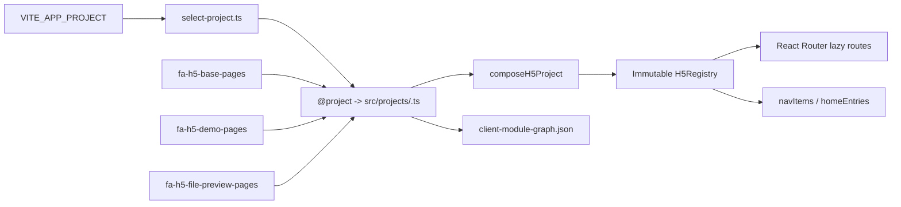

# M2 模块装配 Beta 实施记录

## 状态

| 项目 | 内容 |
|---|---|
| 里程碑 | M2 模块装配 Beta |
| 当前状态 | In Progress |
| 任务进度 | 7/8 |
| 实施日期 | 2026-07-23 |
| 未完成项 | production 异步 Chunk 与客户端模块图产物验证 |

M2 已完成 Feature/Project/Registry、构建时项目选择、两个示例模块和工程门禁。按照仓库约定，本次未执行完整 Vite build，因此不将 M2 标记为 `Ready for Acceptance` 或 `Completed`。

## 装配架构

- `default` 静态导入 `fa-h5-base-pages`、`fa-h5-file-preview-pages` 和 `fa-h5-demo-pages`。
- `demo` 静态导入与 default 相同的 Feature 集，用于保留独立 Project 预设的组合验证入口。
- `fa-h5-file-preview-pages` 是无导航入口的公共能力 Feature，只提供 `/preview` 路由。
- `@project` 只允许由 `platform/feature/runtime.ts` 消费。
- Feature 运行时代码不扫描目录，不读取 `VITE_APP_PROJECT`，也不依赖具体 Project。
- Router 从 Registry 生成 `/app` 子路由；页面组件仍由 `route.lazy()` 动态导入。

## 核心契约与校验

已实现以下不可变输出：

- `project`
- `featureIds`
- `featureMap`
- `routeMap`
- `routes`
- `navItems`
- `homeEntries`
- `lifecycleWarnings`

Composer 会阻断：

- 非法 Project/Feature ID、空标题和错误 `basePath`。
- 重复 Feature ID、route ID、规范化 route path、permission、nav ID 和 home entry ID。
- route ID 与所属 Feature 不一致。
- route path 携带 `/h5` basename、尾斜杠或业务鉴权路由缺少 permission。
- nav/home entry 引用未注册路由，以及登录导航引用 public route。
- 缺失依赖、重复依赖、自依赖和循环依赖。
- 默认路由不存在。
- deprecated Feature 缺少迁移说明或 Project 迁移确认不一致。

Registry 的 Map 使用只读包装，不暴露 `set/delete/clear`；顶层对象和数组均冻结。

### 平台 Feature ID 兼容

M0 的类型模板写作 `fa-<domain>-h5-pages`，但 Roadmap、ADR、目录规范和示例同时固定了 `fa-h5-base-pages`、`fa-h5-demo-pages`。M2 按已冻结的实际目录兼容两种受控格式：

- 平台模块：`fa-h5-<name>-pages`
- 业务模块：`fa-<domain>-h5-pages`

未放宽为任意 `fa-*-pages`。

## Feature 与项目预设

| Project | Feature 集 | 路由 |
|---|---|---|
| `default` | `fa-h5-base-pages`、`fa-h5-file-preview-pages`、`fa-h5-demo-pages` | `/app/home`、`/app/me`、`/preview`、`/app/demo`、`/app/demo/button` |
| `demo` | `fa-h5-base-pages`、`fa-h5-file-preview-pages`、`fa-h5-demo-pages` | `/app/home`、`/app/me`、`/preview`、`/app/demo`、`/app/demo/button` |

`fa-h5-base-pages` 提供工作台和个人中心。工作台从 Registry 读取首页入口，Demo Feature 贡献“Demo”入口并进入组件示例列表。

自动目录见 [Feature / Project 目录](../feature-catalog.generated.md)。

## 工程门禁

| 命令 | 用途 |
|---|---|
| `pnpm select:project` | 校验 `VITE_APP_PROJECT`，组合当前项目并写入临时选择记录 |
| `pnpm check:projects` | 校验 default/demo 组合和冲突夹具 |
| `pnpm check:project-matrix` | 校验所有项目、Feature 目录与引用矩阵 |
| `pnpm check:boundaries` | 阻断跨 Feature 深层导入、Project 反向依赖、运行时扫描和桌面端依赖 |
| `pnpm catalog:generate` | 生成 Feature/Project/Route 目录 |
| `pnpm catalog:check` | 检查生成目录是否漂移 |
| `pnpm check:engineering` | 串联全部 M2 工程检查 |

`check:boundaries` 明确禁止：

- `import.meta.glob` 运行时全量发现。
- Feature 读取 `@project`、Project 源码或 `import.meta.env`。
- 跨 Feature 深层 import 或未在 `dependsOn` 声明的公共依赖。
- Admin 源码、桌面 `antd`、`@ant-design/icons` 和 `@fa/ui`。

Vite production build 会输出 `client-module-graph.json`，记录项目 ID、启用/实际打包 Feature、route ID 和 H5 应用模块；检测到未启用 Feature 或禁止依赖时直接终止构建。

## 已执行验证

| 检查 | 结果 |
|---|---|
| `pnpm run check` | 通过；Node、项目夹具、项目矩阵、边界、目录同步和 TypeScript 均通过 |
| `pnpm run lint` | 通过；Biome 检查 55 个相关文件 |
| 冲突夹具 | 重复 Feature、缺失依赖、循环依赖、动态路由冲突和导航冲突均按预期失败 |
| `default` 开发服务器 | `/h5/app/home` 显示功能入口；`/h5/app/demo` 展示 Demo 列表并可进入 Button Demo |
| `demo` 开发服务器 | `/h5/app/home` 显示功能入口；`/h5/app/demo` 展示 Demo 列表并可进入 Button Demo |

## 剩余工作与完成条件

- 分别以 `default`、`demo` 执行 production build。
- 确认两套产物都生成 `client-module-graph.json`。
- 确认 default 模块图和异步 Chunk 包含 `fa-h5-demo-pages`，且 Button 页面保持异步加载。
- 确认模块图不含 Admin、桌面 Ant Design、`@ant-design/icons` 和 `@fa/ui`。
- 记录路由动态 import 对应的异步 Chunk，并确认登录页不引入业务页面模块。
- 完成后将 M2 任务更新为 `8/8`；任务全部完成但验收未签署时标记 `Ready for Acceptance`，验收门槛全部通过后再标记 `Completed`。

## 与 M1 的关系

M1 的 production 性能基线和 Maven/JAR 静态资源验收仍未完成。本次按用户指令开始 M2，并保留该依赖缺口；M2 的 production 构建验证可与 M1 性能测量合并执行，但两个里程碑必须分别记录结果。
